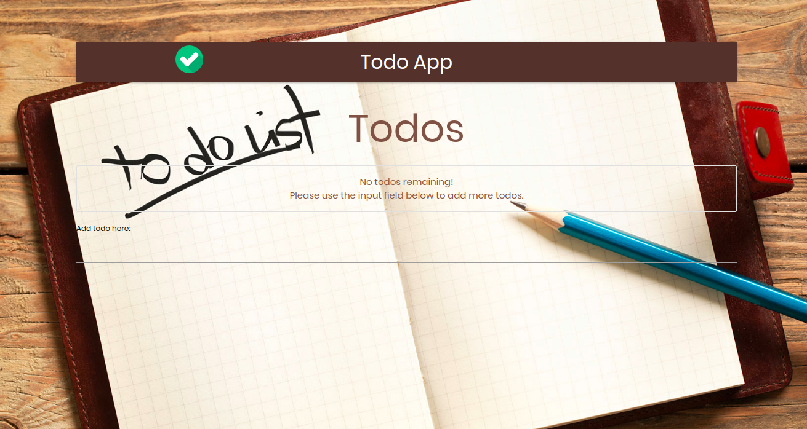
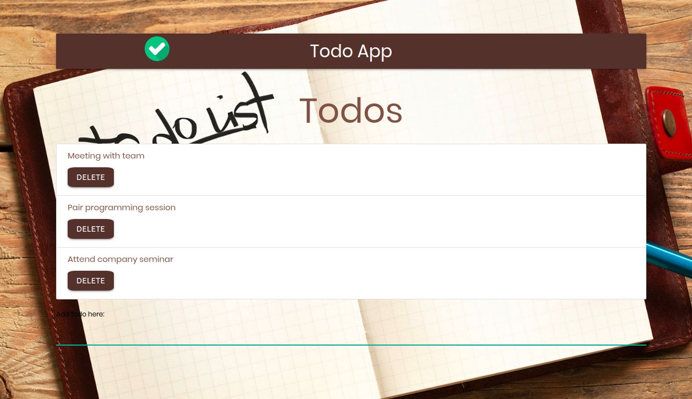

# Todo React App

This is a todo app I built to practice and solidify my knowledge of React.

[Todo app](https://todos-react-app.netlify.com/)

## Mission

- Add and delete Todos.
- Practice React.

## How does the app work

1. Use the input field to add a todo to the list above.
1. A delete button will be rendered with the todo so you can delete it after completing that todo.
1. How the .map() method works in React.

## What did I learn from this

1. Really understand how props and functions are passed down from component to component
1. Learned how High Order Component work to give a component super powers.
1. A list in React always needs a key, especially if you want to remove that list item.

## Goal

I'll be using this front-end and try to add a back-end, using Nodejs and Mongodb, to it where the todos are saved in a database and deleted from it too.
